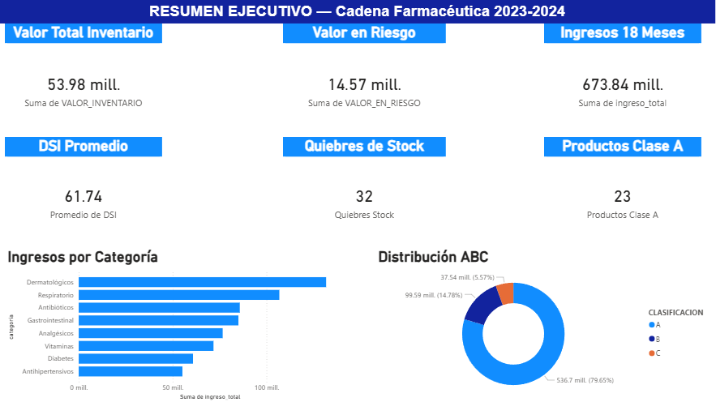
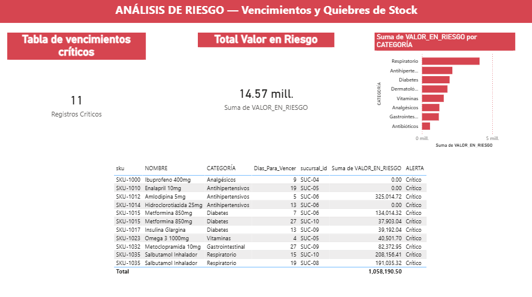
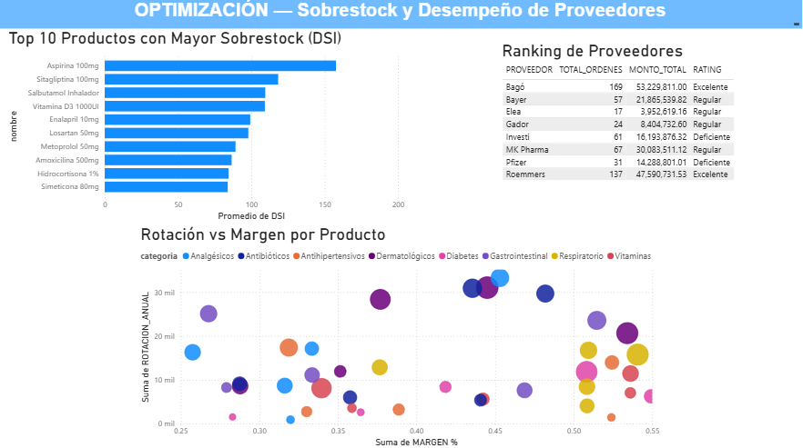

# Análisis de Inventarios — Cadena Farmacéutica

## Descripción del Proyecto

Proyecto de análisis de inventarios para una cadena farmacéutica de 10 sucursales con 40 SKUs activos. El objetivo fue identificar productos en riesgo de vencimiento, quiebres de stock, sobrestock y evaluar el desempeño de proveedores — todo consolidado en un dashboard ejecutivo interactivo en Power BI.

**Período analizado:** Enero 2023 – Junio 2024 (18 meses)
**Volumen de datos:** +110,000 registros transaccionales

---

## Problema de Negocio

La cadena farmacéutica enfrentaba pérdidas por tres causas principales:

 **Vencimientos no detectados a tiempo** — productos que expiran en stock sin venderse
 **Quiebres de stock recurrentes** — ventas perdidas por falta de reposición oportuna
 **Proveedores con bajo cumplimiento** — demoras en entregas que afectan la disponibilidad

---

## Stack Tecnológico

| Herramienta | Uso |
|---|---|
|  Python | Generación y simulación de datos realistas |
|  Excel | Limpieza, validación y cálculo de KPIs base |
|  Power BI | Dashboard ejecutivo interactivo |

---

##  Estructura del Proyecto

```
portafolio-inventario-farmacia/
│
│-- Datos_crudos/
│   │-- productos.csv
│   │-- sucursales.csv
│   │-- inventario_actual.csv
│   │-- ventas.csv
│   │-- movimientos.csv
│   │-- ordenes_compra.csv
│
│-- Datos_limpio
│   │-- KPIs_Base.xlsx 
│   │-- Limpieza.xlsx  
│
│-- Generar_datos
│   │-- generar_datos.py
│
│-- Presentacion
│   │-- Inventario_Farmacia.pbix
│   │-- Analisis_de_riesgo.png
│   │-- Optimizacion.png
│   │-- Resumen_ejecutivo.png
│
│-- README.md
```

---

## KPIs Principales

| KPI | Valor | Descripción |
|---|---|---|
|  Valor Total Inventario | $53.98M | Stock valorizado a precio de costo |
|  Valor en Riesgo | $14.57M | Inventario próximo a vencer (<90 días) |
|  Ingresos 18 Meses | $673.84M | Ingresos totales del período |
|  DSI Promedio | 61.7 días | Días de inventario disponible |
|  Quiebres de Stock | 32 | Registros con stock = 0 |
|  Productos Clase A | 23 | SKUs que generan el 79.65% de ingresos |

---

##  Hallazgos Clave

###  Riesgos Detectados

- El **valor en riesgo por vencimientos representa el 27% del valor total** del inventario — riesgo financiero crítico
- **32 registros con quiebre de stock** — ventas perdidas no cuantificadas en el período
- **Investi y Pfizer** presentan cumplimiento menor al 85% — riesgo de desabastecimiento
- DSI promedio de 61.7 días con **picos superiores a 150 días** en productos de baja rotación

###  Fortalezas Identificadas

- **23 productos Clase A** generan el 79.65% de los ingresos (principio de Pareto confirmado)
- **Bagó y Roemmers** con cumplimiento superior al 92% — proveedores estratégicos confiables
- Ingresos de $673M en 18 meses con **crecimiento sostenido por categoría**
- Categoría **Dermatológicos** lidera en ingresos totales

###  Recomendaciones

1. Implementar **alertas automáticas** para productos con DSI < 30 días
2. **Renegociar contratos** con Investi y Pfizer o buscar proveedores alternativos
3. Priorizar reposición de los **23 productos Clase A** para evitar quiebres
4. Aplicar **descuentos preventivos** a los 11 registros con vencimiento en menos de 30 días

---

##  Dashboard Power BI

El dashboard cuenta con **3 páginas interactivas**:

### Página 1 — Resumen Ejecutivo

KPIs generales + ingresos por categoría + distribución ABC

### Página 2 — Análisis de Riesgo

Productos próximos a vencer + valor en riesgo por categoría

### Página 3 — Optimización

Top 10 sobrestock + ranking de proveedores + dispersión rotación vs margen


---

##  Cómo Ejecutar el Proyecto

### 1. Generar los datos
```bash
cd 2_python
pip install pandas numpy faker
python generar_datos.py
```

### 2. Abrir los archivos Excel
Abrir en orden:
1. `Limpieza.xlsx`
2. `KIPs_base.xlsx` — actualizar conexiones si es necesario

### 3. Abrir el dashboard
Abrir `Inventario_Farmacia.pbix` en Power BI Desktop y actualizar el origen de datos apuntando a la carpeta `Datos_limpio/`.

---

## Autor

**Braian Cano**

[](https://www.linkedin.com/in/braian-cano-97846929a/)
[](https://github.com/BraianCano)

---


